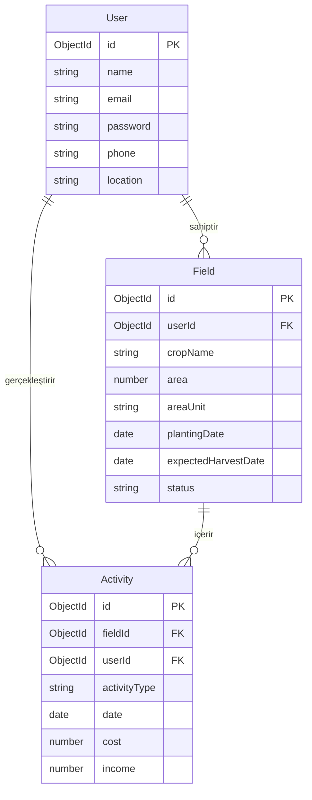
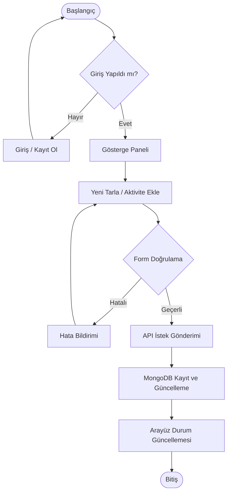

# 🌾 Tarım Asistanı (Farmer Assistant)

Tarım Asistanı, çiftçilerin tarlalarını, ekim süreçlerini ve tüm tarımsal faaliyetlerini (ekim, sulama, gübreleme, ilaçlama, hasat vb.) kolayca planlayıp takip edebilecekleri, gelir-gider analizleri ile tarla performans raporlarını inceleyebilecekleri premium tasarımlı, full-stack bir **MERN Stack** uygulamasıdır.

Bu proje, **BLG330 - Web Programlama Dönem Projesi** gereksinimlerine uygun olarak akademik standartlarda geliştirilmiştir.

---

## 🚀 Öne Çıkan Özellikler

- **Gösterge Paneli (Dashboard):** Toplam tarla alanı, gelir, gider ve net kar/bakiye durumunu gösteren özet kartları ve son aktivitelerin listelenmesi.
- **Tarla Yönetimi (Fields CRUD):** Çiftçilerin tarlalarını ürün adı, alan boyutu, ekim ve hasat tarihleri, toprak tipi ve su ihtiyacı bilgileriyle yönetebilmesi.
- **Faaliyet Takibi (Activities CRUD):** Tarlalarda yapılan ekim, sulama, gübreleme, ilaçlama ve hasat gibi operasyonların maliyet, gelir, süre ve hava durumu detaylarıyla kaydı.
- **Rapor ve Analizler:** Tarla bazlı detaylı gider analizleri, alan başına maliyet hesaplama ve aktivite istatistikleri.
- **Güvenli Kimlik Doğrulama:** JWT (JSON Web Token) tabanlı oturum yönetimi, bcrypt şifre hashleme ve hem frontend hem de backend seviyesinde korumalı rotalar.
- **Premium Arayüz:** Doğadan ilham alan, responsive (mobil uyumlu) "Commonland Sage Green" tasarım teması.

---

## 🛠️ Kullanılan Teknolojiler

### Backend
- **Node.js & Express.js:** RESTful API mimarisi ve MVC yapısı.
- **MongoDB & Mongoose:** NoSQL veri depolama, şema validasyonu ve ilişkisel popülasyon (`ref`/`populate`).
- **JSON Web Token (JWT):** Güvenli kimlik doğrulama.
- **Bcrypt.js:** Şifre güvenliği ve hashleme.

### Frontend
- **React.js (v18):** Bileşen tabanlı modern arayüz mimarisi.
- **React Router Dom (v6):** Sayfa yönlendirmeleri ve korumalı rotalar.
- **Axios:** Backend API entegrasyonu ve token interceptor mekanizması.
- **CSS3 Vanilla:** Modern, özelleştirilmiş, responsive ve estetik tasarım sistemi.

---

## 📊 UML ve Tasarım Diyagramları

Projenin detaylı UML dokümantasyonuna [UML_DIAGRAMS.md](file:///c:/Users/mustafa/OneDrive/Masaüstü/26%20bahar%20projelri/web/docs/UML_DIAGRAMS.md) dosyasından ulaşabilirsiniz. Ana diyagramlar aşağıda özetlenmiştir:

### 1. Varlık-İlişki (ER) Diyagramı


### 2. Kullanıcı Akış (Activity) Diyagramı


---

## 🔌 API Endpoint Listesi

### Kimlik Doğrulama (`/api/auth`)
- `POST /register` - Yeni kullanıcı kaydı.
- `POST /login` - Kullanıcı girişi ve JWT üretimi.
- `GET /me` - Giriş yapmış kullanıcının bilgileri (Korumalı).

### Tarlalar (`/api/fields`) (Tüm Rotalar Korumalıdır)
- `GET /` - Kullanıcıya ait tüm tarlaları listeler.
- `POST /` - Yeni bir tarla oluşturur.
- `GET /:id` - Belirli bir tarlanın detaylarını getirir.
- `PUT /:id` - Tarla bilgilerini günceller.
- `DELETE /:id` - Tarlayı ve ona bağlı aktiviteleri siler.

### Faaliyetler (`/api/activities`) (Tüm Rotalar Korumalıdır)
- `GET /` - Tarlalara ait aktiviteleri listeler (Tarla ID veya türe göre filtrelenebilir).
- `POST /` - Yeni faaliyet kaydı oluşturur.
- `GET /:id` - Faaliyet detayını getirir.
- `PUT /:id` - Faaliyet bilgisini günceller.
- `DELETE /:id` - Faaliyeti siler.

---

## 💻 Kurulum ve Çalıştırma Adımları

Projeyi lokal bilgisayarınızda çalıştırmak için aşağıdaki adımları sırasıyla uygulayınız:

### 1. Depoyu Klonlayın
```bash
git clone https://github.com/mustafakaragenc/tarimasistani.git
cd tarimasistani
```

### 2. Backend Kurulumu ve Başlatılması
```bash
cd backend
npm install
```
`backend` klasörünün içinde `.env` dosyası oluşturun ve aşağıdaki değişkenleri tanımlayın:
```env
PORT=5000
MONGODB_URI=mongodb+srv://tarim_user:Tarim123!@#@tarimasistani.wd9la8d.mongodb.net/?appName=tarimasistani
JWT_SECRET=tarim_asistani_secret_key_2024_production
NODE_ENV=development
```
Backend sunucusunu başlatın:
```bash
npm run dev
```

### 3. Frontend Kurulumu ve Başlatılması
Yeni bir terminal açıp projenin ana dizinine gidin, ardından:
```bash
cd frontend
npm install
npm start
```
Uygulama otomatik olarak tarayıcınızda `http://localhost:3000` adresinde açılacaktır.

---

## 🔑 Örnek Test Kullanıcı Bilgileri
- **E-posta:** `mustafa@gmail.com`
- **Şifre:** `123456`

