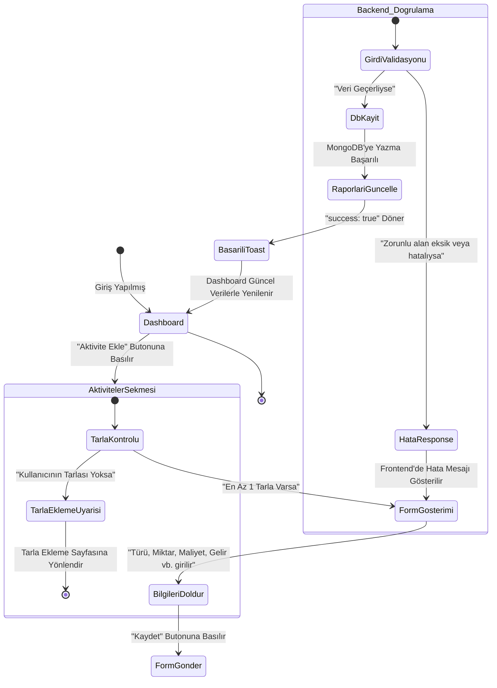
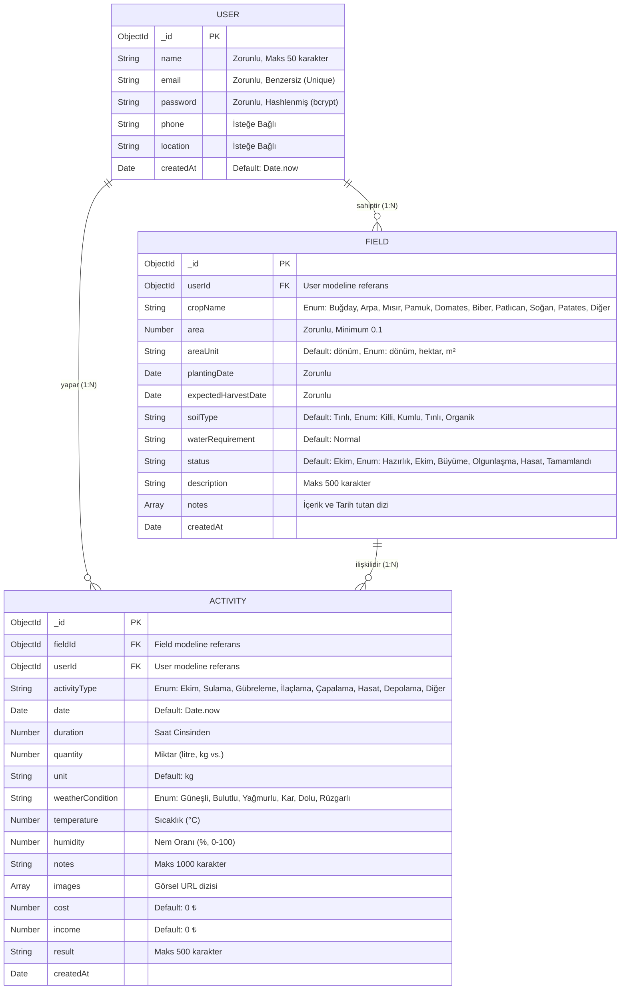
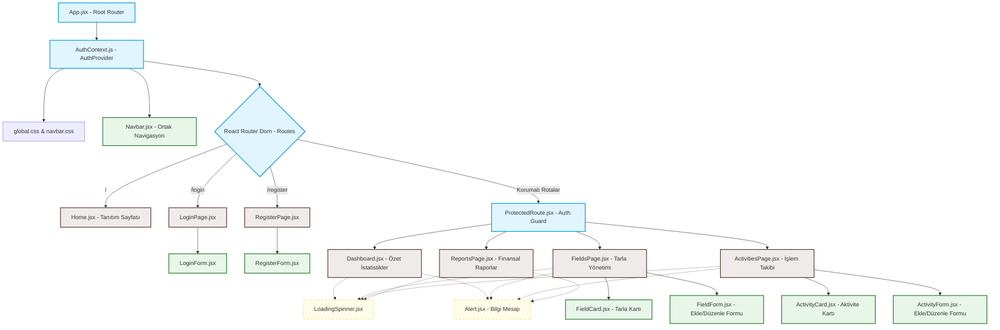

# 📊 Tarım Asistanı - UML ve Tasarım Dokümantasyonu

Bu doküman, **BLG330 - Web Programlama Dönem Projesi** gereksinimleri doğrultusunda hazırlanan UML diyagramlarını ve veritabanı şema tasarımlarını içermektedir. Diyagramlar modern **Mermaid.js** formatında hazırlanmış olup, uyumlu herhangi bir Markdown okuyucuda (GitHub vb.) veya Mermaid editörlerinde canlı olarak görüntülenebilir.

---

## 1. Use-Case (Kullanım Senaryosu) Diyagramı

Use-Case diyagramı, sistemin ana aktörü olan **Çiftçi (Kullanıcı)** ile sistemin sunduğu fonksiyonel özellikler arasındaki ilişkileri gösterir.

```mermaid
usecaseDiagram
    actor Ciftci as "🌾 Çiftçi (Kullanıcı)"

    rect "Tarım Asistanı Sistemi"
        usecase UC_Reg as "Kayıt Ol (Register)"
        usecase UC_Log as "Giriş Yap (Login)"
        usecase UC_Me as "Profil Bilgilerini Görüntüle"
        
        usecase UC_F_Add as "Yeni Tarla Ekle"
        usecase UC_F_List as "Tarlaları Listele"
        usecase UC_F_Update as "Tarla Bilgilerini Güncelle"
        usecase UC_F_Del as "Tarla Sil"
        
        usecase UC_A_Add as "Aktivite Kaydı Ekle (Ekim, Sulama vb.)"
        usecase UC_A_List as "Aktiviteleri Listele ve Filtrele"
        usecase UC_A_Update as "Aktivite Güncelle"
        usecase UC_A_Del as "Aktivite Sil"
        
        usecase UC_Rep as "Maliyet ve Gelir Raporlarını İncele"
    end

    %% Aktörün Yetkisiz Yapabildiği İşlemler
    Ciftci --> UC_Reg
    Ciftci --> UC_Log

    %% Aktörün Yetkili (Giriş Yaptıktan Sonra) Yapabildiği İşlemler
    Ciftci --> UC_Me
    Ciftci --> UC_F_Add
    Ciftci --> UC_F_List
    Ciftci --> UC_F_Update
    Ciftci --> UC_F_Del
    Ciftci --> UC_A_Add
    Ciftci --> UC_A_List
    Ciftci --> UC_A_Update
    Ciftci --> UC_A_Del
    Ciftci --> UC_Rep

    %% İlişkiler ve Korumalı Rota Gereksinimi
    note right of UC_Me : "Korumalı Rota (JWT Authorization)"
    note right of UC_F_Add : "Korumalı Rota (JWT Authorization)"
    note right of UC_A_Add : "Korumalı Rota (JWT Authorization)"
```

---

## 2. Activity (Aktivite / İş Akış) Diyagramı

Aşağıdaki diyagram, bir çiftçinin **"Yeni Aktivite Kaydı Oluşturma (Maliyet/Gelir Kaydı)"** sürecinin iş akışını ve sistemin yanıt verme adımlarını gösterir.



---

## 3. Veritabanı ER (Entity-Relationship) Diyagramı

Mongoose şemaları kullanılarak oluşturulan veritabanı modellerinin (User, Field, Activity) alanlarını ve aralarındaki bire-çok (1:N) ilişkilerini gösteren ER diyagramı.



---

## 4. Component Relationship (React Bileşen Hiyerarşisi) Diyagramı

React uygulamasının (Frontend) bileşen ağacını, global Context sarmalayıcısını ve korumalı rotaların sayfa bileşenleriyle ilişkisini gösteren yapı şeması.



---

## 💡 Diyagramları Raporunuz için PDF veya Görsele Dönüştürme Yolu

Mermaid diyagramlarını Word veya PDF formatındaki proje raporunuza eklemek için şu adımları takip edebilirsiniz:

1. **[Mermaid Live Editor](https://mermaid.live/)** adresine gidin.
2. Yukarıdaki diyagram kodlarından birini kopyalayıp sol taraftaki kod alanına yapıştırın.
3. Sağ alt köşedeki **"PNG"** veya **"SVG"** indirme butonlarına basarak diyagramı yüksek kalitede bilgisayarınıza indirin.
4. İndirdiğiniz görseli projenizin rapor dosyasına doğrudan ekleyebilirsiniz.
