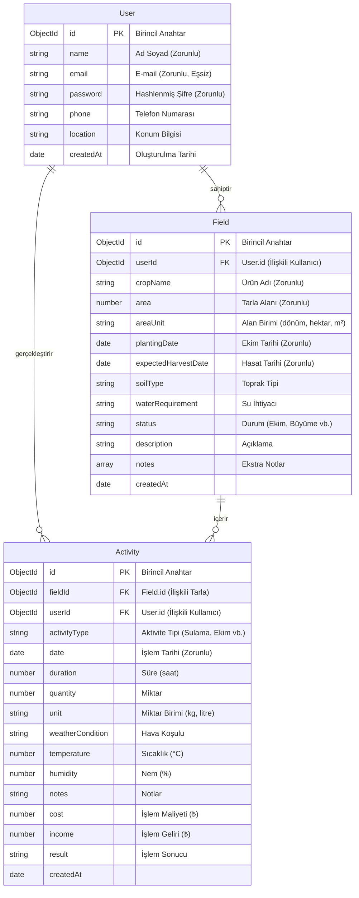

# 📊 Tarım Asistanı - UML ve Tasarım Dokümantasyonu

Bu dosya, **BLG330 - Web Programlama Dönem Projesi** kapsamında geliştirilen **Tarım Asistanı MERN Stack** uygulamasının mimari ve tasarım diyagramlarını içermektedir. Diyagramlar, doğrudan GitHub ve uyumlu Markdown okuyucularda görüntülenebilen **Mermaid.js** formatında hazırlanmıştır.

---

## 1. Use-Case Diagram (Kullanım Senaryoları Diyagramı)

Use-Case diyagramı, uygulamanın ana aktörü olan **Çiftçi (Kullanıcı)** ile sistem arasındaki etkileşimleri ve gerçekleştirebileceği işlemleri gösterir.

```mermaid
graph TB
    subgraph Aktörler
        c["🌾 Çiftçi (Kullanıcı)"]
    end

    subgraph Tarım Asistanı Uygulaması
        uc1(["Kayıt Ol (Register)"])
        uc2(["Giriş Yap (Login)"])
        uc3(["Gösterge Panelini Görüntüle (Dashboard)"])
        
        subgraph Tarla Yönetimi (Fields CRUD)
            uc4(["Yeni Tarla Ekle"])
            uc5(["Tarlaları Listele"])
            uc6(["Tarla Bilgilerini Güncelle"])
            uc7(["Tarla Sil"])
        end

        subgraph Aktivite Yönetimi (Activities CRUD)
            uc8(["Yeni Aktivite Ekle (Ekim, Sulama vb.)"])
            uc9(["Aktiviteleri Listele / Filtrele"])
            uc10(["Aktivite Bilgilerini Güncelle"])
            uc11(["Aktivite Kaydını Sil"])
        end

        subgraph Analiz & Raporlama
            uc12(["Gider Analizi Görüntüle"])
            uc13(["Aktivite İstatistiklerini İncele"])
        end
    end

    c --> uc1
    c --> uc2
    c --> uc3
    c --> uc4
    c --> uc5
    c --> uc6
    c --> uc7
    c --> uc8
    c --> uc9
    c --> uc10
    c --> uc11
    c --> uc12
    c --> uc13
```

---

## 2. Activity Diagram (Aktivite Akış Diyagramı)

Aşağıdaki diyagram, sisteme yeni bir **Aktivite Kaydı** (örn: Sulama veya Gübreleme işlemi) eklenirken arka planda ve arayüzde gerçekleşen işlem adımlarını ve karar mekanizmalarını göstermektedir.

```mermaid
graph TD
    Start([Başlangıç: Yeni Aktivite Kaydetme]) --> AuthCheck{Kullanıcı Giriş Yapmış mı?}
    AuthCheck -- Hayır --> Login[Giriş Sayfasına Yönlendir] --> Start
    AuthCheck -- Evet --> SelectField[Tarlayı Seç ve Aktivite Formunu Doldur]
    SelectField --> ValidateForm{Arayüz Validasyonu Geçti mi?}
    ValidateForm -- Hayır --> ShowError[Arayüzde Hata Mesajı Göster] --> SelectField
    ValidateForm -- Evet --> Submit[İsteği Sunucuya Gönder (POST /api/activities)]
    Submit --> BackendValidate{Sunucu Validasyonu ve JWT Kontrolü}
    BackendValidate -- Hata / Geçersiz Token --> ReturnErr[Hata Yanıtı Dön (400/401/500)] --> ShowError
    BackendValidate -- Başarılı --> DB[MongoDB'ye Aktivite Verisini Kaydet]
    DB --> Pop[Aktiviteyi Tarla Bilgisiyle Popüle Et (Populate)]
    Pop --> Resp[Başarılı Yanıt Dön (201 Created)]
    Resp --> StateUpdate[React State'ini Güncelle (useState)]
    StateUpdate --> UI[Dashboard ve Rapor Arayüzlerini Yenile]
    UI --> End([Bitiş: Aktivite Başarıyla Eklendi])
```

---

## 3. ER Diagram (Veritabanı ER Diyagramı)

Uygulamanın MongoDB (Mongoose) veritabanı şemaları arasındaki ilişkileri (1-to-Many) gösteren Varlık-İlişki (ER) diyagramıdır.



---

## 4. Component Relationship Diagram (React Bileşen Diyagramı)

React (Frontend) tarafındaki bileşenlerin hiyerarşik ilişkisini, yönlendirme (React Router) yapısını ve global state (`AuthContext`) paylaşımını gösteren diyagramdır.

```mermaid
graph TD
    App[App.jsx] --> Router[React Router]
    App --> AuthProvider[AuthProvider - AuthContext.js]
    
    subgraph Ortak Bileşenler
        Navbar[Navbar.jsx]
        ProtectedRoute[ProtectedRoute.jsx]
        LoadingSpinner[LoadingSpinner.jsx]
        Alert[Alert.jsx]
    end

    subgraph Sayfalar
        Home[Home.jsx]
        LoginPage[LoginPage.jsx] --> LoginForm[LoginForm.jsx]
        RegisterPage[RegisterPage.jsx] --> RegisterForm[RegisterForm.jsx]
        
        subgraph Korumalı Sayfalar (Protected Routes)
            Dashboard[Dashboard.jsx]
            FieldsPage[FieldsPage.jsx] --> FieldCard[FieldCard.jsx]
            FieldsPage --> FieldForm[FieldForm.jsx]
            
            ActivitiesPage[ActivitiesPage.jsx] --> ActivityCard[ActivityCard.jsx]
            ActivitiesPage --> ActivityForm[ActivityForm.jsx]
            
            ReportsPage[ReportsPage.jsx]
        end
    end

    Router --> Home
    Router --> LoginPage
    Router --> RegisterPage
    Router --> ProtectedRoute
    
    ProtectedRoute --> Dashboard
    ProtectedRoute --> FieldsPage
    ProtectedRoute --> ActivitiesPage
    ProtectedRoute --> ReportsPage

    AuthProvider -.->|Global State: user, token, login, logout| LoginPage
    AuthProvider -.->|Global State: user, token, login, logout| RegisterPage
    AuthProvider -.->|Global State: user, token, login, logout| Navbar
    AuthProvider -.->|Global State: user, token, login, logout| ProtectedRoute
```
